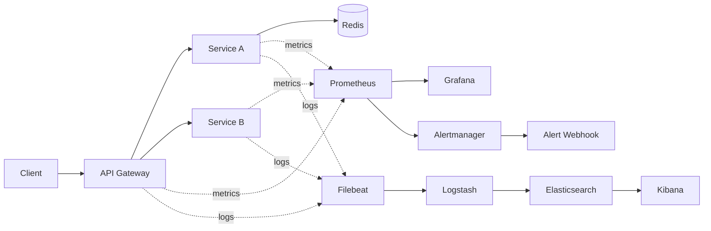

# ResilientOps: Self-Healing Distributed System

ResilientOps is a production-inspired SRE project that demonstrates how distributed systems behave under failure, how to observe those failures, and how to automate recovery.

## Executive Summary

This repository is intentionally structured as an SRE systems project, not an application feature demo.

- Reliability-first design: failures are expected, injected, measured, and recovered.
- Operational visibility: metrics, logs, and alerts are treated as first-class outputs.
- Automation-first operations: repetitive incident response actions are scriptable and reproducible.
- Heterogeneous services: Python and Go workloads are deployed and operated under one platform.

If you are evaluating this project for systems depth, focus on the failure scenarios, recovery behavior, and observability artifacts rather than UI or business features.

## Recruiter Quick Scan

- Distributed architecture with API gateway plus multiple internal services.
- Kubernetes health probes, restart behavior, and HPA-based scaling.
- Prometheus, Grafana, Alertmanager, and ELK integrated into a single environment.
- Fault injection for crash, latency, error, dependency, CPU, memory, and network failures.
- Documented runbook and design document for incident-driven operations.

Primary documents:

- docs/design-document.md
- docs/architecture.md
- docs/failure-scenarios.md
- docs/runbook.md

## Reliability Evaluation Model

This project is designed to be evaluated with SRE-oriented criteria:

- Mean Time To Detect (MTTD): time to detect degradation from metrics/logs/alerts.
- Mean Time To Recover (MTTR): time from detection to healthy steady state.
- Availability under injected failure: percentage of successful user-facing requests during chaos tests.
- Observability completeness: ability to explain incidents from telemetry without guesswork.
- Automation coverage: degree to which diagnosis/recovery is script-driven versus manual.

## What Makes This Serious Engineering Work

- Every major component is containerized and deployable in a reproducible way.
- Failure modes are explicit and operationally testable, not theoretical.
- Recovery paths are codified in scripts, not hidden in ad hoc manual steps.
- Documentation includes architecture intent, experiment methodology, and runbook operations.
- Cross-service behavior is observable from both metrics and centralized logs.

## What This Project Demonstrates

- Reliability engineering mindset, not only tool usage.
- Fault injection (crashes, latency, errors, dependency loss, CPU pressure).
- Self-healing via Kubernetes probes, restart behavior, and autoscaling.
- Operational observability through metrics dashboards and centralized logs.
- Debugging workflows using Linux and Kubernetes primitives.

## Stack

- API Gateway: Python FastAPI
- Service A: Python FastAPI + Redis dependency
- Service B: Go HTTP service
- Orchestration: Kubernetes (Deployments, Services, probes, HPA)
- Metrics: Prometheus + Grafana
- Alerting: Prometheus rules + Alertmanager + internal webhook receiver
- Logging: Elasticsearch + Logstash + Kibana + Filebeat

## Repository Layout

- services/api_gateway: Gateway service code + Dockerfile
- services/service_a: Stateful Python service + Dockerfile
- services/service_b: Go service + Dockerfile
- k8s/base: Full Kubernetes manifests (apps + observability + ELK)
- scripts: Build, deploy, chaos, and recovery automation
- docs: Architecture, runbook, and failure scenario analysis

## Design Document

- docs/design-document.md

## 10-Minute Validation Protocol

Use this sequence to quickly assess project quality and operational behavior:

1. Deploy stack and verify healthy readiness endpoints.
2. Open Grafana and observe baseline latency/error trends.
3. Inject one failure (for example, service crash or latency).
4. Observe detection in metrics and logs.
5. Run recovery workflow and confirm return to healthy state.

This mirrors a realistic on-call loop: baseline, incident, investigation, mitigation, verification.

## Architecture



Additional design notes: docs/architecture.md

## Prerequisites

- Docker
- Kubernetes cluster (kind recommended)
- kubectl
- kind
- Optional: metrics-server for HPA behavior visibility

## Local Setup (uv + Python 3.14)

Install local tooling dependencies:

```bash
uv sync --group dev
```

If monitor script dependencies are needed independently:

```bash
uv pip install -r scripts/monitor/requirements.txt
```

## Build and Deploy

1. Create cluster:

```bash
./scripts/setup-kind.sh
```

2. Build service images:

```bash
./scripts/build-images.sh
```

3. Load images into kind:

```bash
kind load docker-image resilientops/api-gateway:latest --name resilientops
kind load docker-image resilientops/service-a:latest --name resilientops
kind load docker-image resilientops/service-b:latest --name resilientops
kind load docker-image resilientops/alert-webhook:latest --name resilientops
```

4. Deploy full stack:

```bash
./scripts/deploy.sh
```

## Access Endpoints

Port-forward core interfaces:

```bash
kubectl -n resilientops port-forward svc/api-gateway 8080:80
kubectl -n resilientops port-forward svc/prometheus 9090:9090
kubectl -n resilientops port-forward svc/grafana 3000:3000
kubectl -n resilientops port-forward svc/kibana 5601:5601
kubectl -n resilientops port-forward svc/alertmanager 9093:9093
```

- Gateway API: http://localhost:8080/api/process
- Prometheus: http://localhost:9090
- Grafana: http://localhost:3000 (admin/admin)
- Kibana: http://localhost:5601

## Observability Coverage

Metrics collected:

- Request latency
- Error rates
- Request throughput
- Service health and readiness
- Pod CPU/memory behavior (when node metrics are available)

Alerting coverage:

- High gateway error ratio
- High gateway p95 latency
- Service-a scrape down detection
- Elevated container memory usage

Dashboard provisioning:

- Configured in k8s/base/grafana-dashboard.yaml
- Datasource and dashboard provider in k8s/base/grafana-datasource.yaml

## Centralized Logging (ELK)

Flow:

1. Filebeat reads Kubernetes container logs.
2. Logstash receives logs over Beats input (5044).
3. Logstash enriches and forwards into Elasticsearch index resilientops-logs-YYYY.MM.dd.
4. Kibana is used for querying and incident triage.

## Failure Simulation

### Service crash

```bash
./scripts/failures/simulate_crash.sh service-a
```

### Latency injection

```bash
./scripts/failures/simulate_latency.sh service-a 1200
```

### Error injection

```bash
./scripts/failures/simulate_error_rate.sh service-b 0.4
```

### Dependency failure

```bash
./scripts/failures/simulate_redis_down.sh
```

### CPU pressure

```bash
./scripts/failures/simulate_cpu_stress.sh service-a
```

### Memory pressure

```bash
./scripts/failures/simulate_memory_stress.sh service-a
```

### Network drop (gateway to service-a)

```bash
./scripts/failures/simulate_network_drop.sh
```

### Network restore

```bash
./scripts/failures/restore_network.sh
```

### Recovery

```bash
./scripts/recover.sh
```

Detailed expected impacts and debugging signals: docs/failure-scenarios.md

## Debugging and System Understanding

Examples:

```bash
kubectl -n resilientops get pods,svc
kubectl -n resilientops exec deploy/api-gateway -- sh -c 'getent hosts service-a service-b redis'
kubectl -n resilientops exec deploy/api-gateway -- ss -tulpen
curl -s http://localhost:8080/api/process | jq
```

These commands demonstrate:

- Service-to-service DNS resolution
- Internal HTTP request lifecycle
- Socket-level process bindings
- Runtime failure impact on end-user requests

## Automation Shortcuts

```bash
make build
make deploy
make chaos-crash
make chaos-latency
make chaos-error
make chaos-redis-down
make chaos-network-drop
make chaos-network-restore
make chaos-mem
make recover
make auto-heal
```

## Automated Recovery Loop

A simple controller script continuously checks end-user success ratio and triggers recovery when a threshold is breached.

```bash
python scripts/automation/auto_heal.py --url http://localhost:8080/api/process
```

## Deliverables Checklist

- Kubernetes-based distributed system
- Python + Go microservices
- Prometheus and Grafana dashboards
- ELK logging pipeline
- Failure simulation scripts
- Documentation for architecture, incidents, and recovery

## Notes and Production Hardening Ideas

- Add Alertmanager and SLO-based alerts.
- Add PodDisruptionBudget and anti-affinity rules.
- Add retry/circuit-breaker behavior in gateway.
- Add OpenTelemetry tracing for request correlation.
- Add canary rollout policy via progressive delivery controller.
